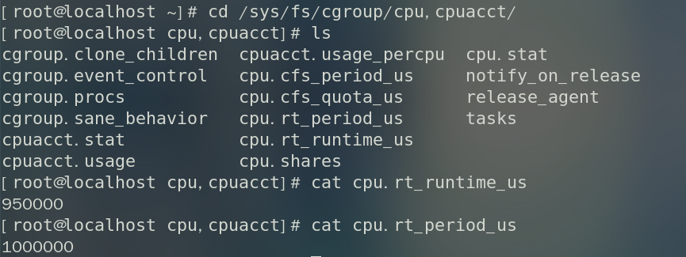
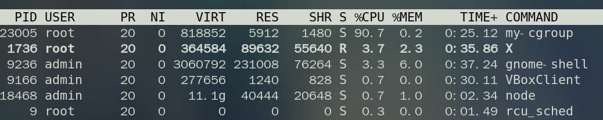
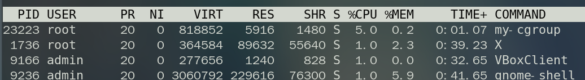
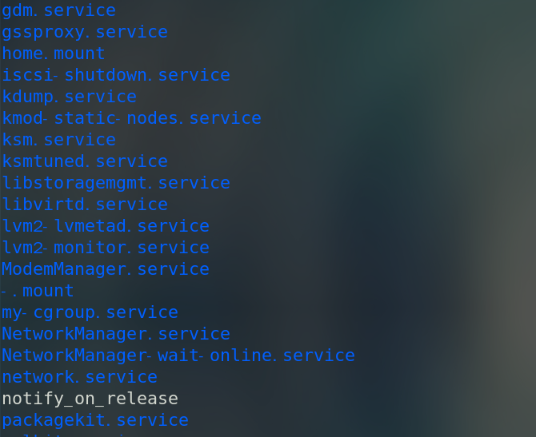
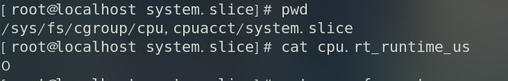

# 使用systemd限制服务cpu导致实时进程启动失败

## 前情提要
我们组开发并维护的一个Linux上的服务，最近突然被隔壁团队测试同事发现会导致他们的业务进程启动不了。经过排查发现由于我们的服务是由systemd管理的，并且通过systemd的配置项来限制了服务整体的cpu和内存资源，这样在服务启动后会在 `/sys/fs/cpu,cpuacct` 目录下生成一个 `system.slice` 目录，这个目录下又会产生所有systemd管理的服务单元(service/unit)及其对应的cgroup文件，其中 `cpu.rt_runtime_us` 文件生成时会写入默认值0，这就导致限制了所有服务单元的实时进程无法分配到cpu时间，从而实时进程无法启动。

## CGroup
cgroups(Control Groups) 是 linux 内核提供的一种机制，这种机制可以根据需求把一系列系统任务及其子任务整合(或分隔)到按资源划分等级的不同组内，从而为系统资源管理提供一个统一的框架。简单说，cgroups可以限制、记录任务组所使用的物理资源。

关于cgroup更细致的介绍可以参考[官方文档](https://www.kernel.org/doc/html/latest/admin-guide/cgroup-v1/index.html)。

那么systemd为什么又会和cgroup扯上关系呢？
简答来说 cgroups 的能力有两个：层级结构(A)和资源控制(B)。首先 cgroups 是以层级结构组织并标识进程的一种方式，同时它也是在该层级结构上执行资源限制的一种方式。我们简单的把 cgroups 的层级结构称为 A，把 cgrpups 的资源控制能力称为 B。

层级结构对于systemd来说是必须的，但资源控制是可选的。在系统启动阶段，systemd 会把支持的 controllers (subsystem 子系统)挂载到默认的 `/sys/fs/cgroup/` 目录下面：


例如，`/sys/fs/cgroup/cpu,cpuaccu/` 是cpu控制子系统，`/sys/fs/cgroup/memory/` 是内存控制子系统

正常情况下 `/sys/fs/cgroup/cpu,cpuaccu/` 目录的内容如下：



其中 `cpu.rt_period_us` 以微秒为单位，指定cgroup对CPU资源访问重新分配的频率，`cpu.rt_runtime_us` 同样以微秒为单位，指定在一个重新分配的时间区间中，此cgroup中的任务对CPU资源连续访问的最大时间。上图中的配置即表示，在1秒内，root cgroup 中的所有任务对CPU连续访问的最大时间是950ms。

## 什么是FIFO进程

linux的进程调度有三种策略：
- SCHED_FIFO：先进先出实时策略，相同优先级的线程按到达顺序排队。
- SCHED_RR：简单的轮循实时调度，所有优先级相同的线程依次获得CPU时间
- SCHED_OTHER：分时调度，是完全公平调度（CFS）的实现

其中 SCHED_FIFO 和 SCHED_RR 都是实时进程的调度策略，linux中实时进程的优先级(0-99)都比普通进程的优先级(100-139)高，且直到进程退出之前始终是活动进程。前面提到的 `cpu.rt_runtime_us` 就是用来限制 cgroup 中实时进程对cpu的占用， `cpu.rt_runtime_us=-1` 可以使当前cgroup中的实时进程运行不受限制。但是这样可能导致在进程出现严重故障时os无法分到CPU时间片进行恢复，影响系统稳定性。

## 如何使用systemd限制service的资源占用

现在使用go实现一个 my-cgroup.service 服务，可以借助[github.com/kardianos/service](https://github.com/kardianos/service)开源库来实现，代码中只有一个死循环：

```go
package main

import (
	"fmt"
	"os"

	"github.com/kardianos/service"
)

type SystemService struct{}

func (ss *SystemService) Start(s service.Service) error {
	fmt.Println("coming Start.......")
	go ss.run()
	return nil
}

func (ss *SystemService) run() {
	fmt.Println("coming run.......")
	for {

	}
}

func (ss *SystemService) Stop(s service.Service) error {
	fmt.Println("coming Stop.......")
	return nil
}

func main() {
	fmt.Println("service.Interactive()---->", service.Interactive())
	svcConfig := &service.Config{
		Name:        "my-cgroup",
		DisplayName: "custom service",
		Description: "this is github.com/kardianos/service test case",
	}

	ss := &SystemService{}
	s, err := service.New(ss, svcConfig)
	if err != nil {
		fmt.Printf("service New failed, err: %v\n", err)
		os.Exit(1)
	}

	if len(os.Args) > 1 {
		err = service.Control(s, os.Args[1])
		if err != nil {
			fmt.Printf("service Control 111 failed, err: %v\n", err)
			os.Exit(1)
		}
		return
	}

	// 默认 运行 Run
	err = s.Run()
	if err != nil {
		fmt.Printf("service Control 222 failed, err: %v\n", err)
		os.Exit(1)
	}
}
```

服务启动后观察cpu使用情况如下：



此时查看 `/sys/fs/cgroup/cpu,cpuaccu/` 目录下是没有 `system.slice` 目录的。
可以使用systemctl set-property来限制其CPU: 

```bash
systemctl set-property my-cgroup.service CPUQuota=5%
```

代码不变，重启服务后可以看到进程对应的cpu占用被限制到了5%以下：



同时可以看到 `/sys/fs/cgroup/cpu,cpuaccu/` 目录下多了 `system.slice` 目录，但是  `system.slice` 目录下除了刚创建的 `my-cgroup` 之外，还多了其他许多目录：



同时可以看到 `system.slice/cpu.rt_runtime_us` 的值为0，也就是说整个system.slice子cgroup中的实时进程无法分配到cpu时间，也就无法启动了。



但是**为什么在限制cpu之前 `/sys/fs/cgroup/cpu,cpuaccu/` 目录下没有 `system.slice` 目录，而限制cpu之后 `/sys/fs/cgroup/cpu,cpuaccu/` 目录下出现了 `system.slice` 目录，并且 `system.slice` 目录中同时多了很多其他的 .service目录呢？**

因为 `systemctl set-property` 限制资源本质上也是通过cgroup实现的，同时由于我们创建的 `my-cgroup` 是system管理的，所以会在root cgroup下生成system.slice目录，同时systemd会创建所有的受其管理的服务单元，并且生成此cgroup的cpu相关文件，其中 `cpu.rt_runtime_us` 的内容是默认值0。同时由于cgroup的层级结构，就会导致 system.slice 中所有子cgroup中的实时进程无法获取到cpu时间。

## 解决方案：
### 方案一
既然是由于cgroup的 `cpu.rt_runtime_us=0` 导致实时进程无法启动，那我把这个值改为大于0不就好了？
这当然是最简单的方法，但是因为cgroup的层级结构原因，需要满足所有子cgroup的 `cpu.rt_runtime_us` 之和不能超过其父cgroup对应的值，同时由于root cgroup也就是 `/sys/fs/cgroup/cpu,cpuaccu/` 下可能会有多个子cgroup，在不了解各子cgroup实时进程对cgroup需求的情况下修改，可能也会存在问题。因此这种方法**不太建议**。

### 方案二
虽然创建的 `my-cgroup.service` 是一个system服务，但是我们也可以不使用systemd来限制其资源，而是直接使用cgroup来限制其cpu等资源。具体来说，可以分为以下步骤：
1. 启动服务主进程
2. 在root cgroup下创建一个子cgroup
3. 将服务主进程加入到cgroup中

这样自己通过cgroup来限制服务资源占用，就不会在 `/sys/fs/cgroup/cpu,cpuaccu/` 目录下创建 `system.slice` 目录，也就不会影响到systemd管理的其他服务单元的实时进程了。

::: warning 注意
如果服务单元主进程还会拉起子进程，需要在**启动子进程之前**将主进程加入到创建的cgroup中去，这样才能使所有启动的子进程继承主进程的cgroup配置，从而使整个服务单元的资源被限定到设置的值以内。

:::

## 参考资料
[Control Groups version 1](https://www.kernel.org/doc/html/latest/admin-guide/cgroup-v1/index.html) 

[使用 systemd 分配系统资源](https://docs.redhat.com/zh-cn/documentation/red_hat_enterprise_linux/9/html/managing_monitoring_and_updating_the_kernel/proc_allocating-system-resources-using-systemd_assembly_using-systemd-to-manage-resources-used-by-applications#proc_allocating-system-resources-using-systemd_assembly_using-systemd-to-manage-resources-used-by-applications)

[https://zhuanlan.zhihu.com/p/75422252](https://zhuanlan.zhihu.com/p/75422252)

[Linux中的实时进程调度](https://www.baeldung-cn.com/linux/real-time-process-scheduling)