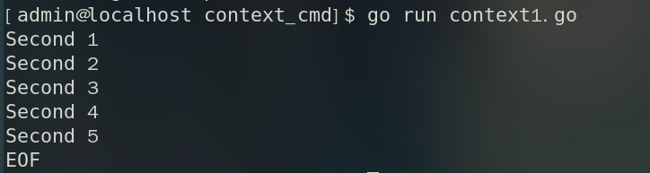

# 关于Go语言中启动子进程后context的超时不生效的情况

[context](https://pkg.go.dev/context)是Go语言的一个官方包，主要功能是跨 API 边界和进程间传递截止时间、取消信号和其他请求范围值。关于context的具体功能和原理本文不做过多介绍，本文主要是探讨context包的一个常用功能：超时机制。

## context.WithTimeout

`context.WithTimeout` 返回一个超时上下文及其退出函数，函数签名如下：

```go
func WithTimeout(parent Context, timeout time.Duration) (Context, CancelFunc) {
    return WithDeadline(parent, time.Now().Add(timeout))
}
```

通常来说，可以使用超时上下文来进行goroutine的超时控制，比如说我现在想在golang程序中运行一个shell脚本，但是这个脚本执行可能会需要很长时间，那此时就可以使用 `context.WithTimeout` 生成一个超时上下文传递给执行脚本的函数，避免脚本执行长时间不结束。
现在使用sleep模拟一个10秒才能执行结束的shell脚本：

```bash
#!/bin/bash

for i in {1..10}; do
  echo "Second $i"
  sleep 1
done
echo "Script finished running."
```

然后在go代码中执行这个脚本，并使用context进行超时控制，假设限制最多只允许执行5秒：
```go
package main

import (
	"context"
	"fmt"
	"os/exec"
	"time"
)

func main() {
	ctx, cancel := context.WithTimeout(context.Background(), time.Second*5)
	// 创建一个命令
	cmd := exec.CommandContext(ctx, "bash", "sleep.sh")

	// 启动命令并获取输出
	stdout, err := cmd.StdoutPipe()
	if err != nil {
		fmt.Println(err)
		return
	}
	cmd.Start()

	// 持续打印输出
	for {
		// 读取输出
		buf := make([]byte, 1024)
		n, err := stdout.Read(buf)
		if err != nil {
			fmt.Println(err)
			break
		}
		// 打印输出
		fmt.Print(string(buf[:n]))
	}

	// 等待命令完成
	cmd.Wait()
	cancel()
}
```
执行结果如下图所示，可以看到本应该在10秒钟才结束的shell脚本，实际上只执行了5秒钟，说明context超时机制生效了。



## 糟糕，超时没有生效
但是今天在go程序中运行一个测试提权的脚本，超时机制竟然没生效，并且导致在go主进程退出之后，启动的外部进程仍然没有退出，成为了僵尸进程！
脚本长这样:
```bash
#!/bin/bash

sudo bash -c 'whoami'
```
下面是简单地对我的go代码的还原。原始程序由于主进程调用方式问题，主进程会退出，脚本中的子进程最终成为僵尸进程。下面的模拟程序主进程会阻塞，直到子进程结束掉。
注意：使用root用户或者可以免密登录的非root用户不存在问题。
```go
package main

import (
	"bytes"
	"context"
	"fmt"
	"os/exec"
	"time"
)

func main() {
	ctx, cancel := context.WithTimeout(context.Background(), time.Second*5)
	cmd := exec.CommandContext(ctx, "bash", "read.sh")
	cmd.Dir = "./"
	bufout := bytes.Buffer{}
	buferr := bytes.Buffer{}
	cmd.Stdout = &bufout
	cmd.Stderr = &buferr

	if err := cmd.Run(); err != nil {
		if ctx.Err() == context.DeadlineExceeded {
			fmt.Println("Command timed out")
		}
		fmt.Println(err)
	}
	time.Sleep(time.Second * 5)
	cancel()
}
```
在使用非root用户运行之后，控制台会提示让输入密码：
```
[sudo] admin 的密码：
```
此时如果不输入密码的话，程序就会一直阻塞住，即使sleep和context的5s时间已经过去程序也不会退出。
但是，如果将下面四行代码去掉的话，程序就可以打印 `Command timed out` 然后退出：
```go
bufout := bytes.Buffer{}
bufferr := bytes.Buffer{}
cmd.Stdout = &bufout
cmd.Stderr = &bufferr
```
我猜想原因可能是标准输出或者标准错误的IOPipes一直没有关闭导致。
但是上面的代码注释掉后，虽然程序可以退出，退出之后会惊奇地发现，终端输入命令没有回显了！！！

最终还是通过强制关闭整个进程组的方式让程序正常退出：
```go
package main

import (
	"bytes"
	"context"
	"fmt"
	"os/exec"
	"syscall"
	"time"
)

func main() {
	ctx, cancel := context.WithTimeout(context.Background(), time.Second*5)
	// 创建一个命令
	cmd := exec.CommandContext(ctx, "bash", "read.sh")
	cmd.Dir = "./"
	bufout := bytes.Buffer{}
	bufferr := bytes.Buffer{}
	cmd.Stdout = &bufout
	cmd.Stderr = &bufferr
	cmd.Stdin = nil

	cmd.SysProcAttr = &syscall.SysProcAttr{Setpgid: true}

	go func() {
		<-ctx.Done()
		syscall.Kill(-cmd.Process.Pid, syscall.SIGKILL) // 强制终止整个进程组
	}()
	if err := cmd.Run(); err != nil {
		if ctx.Err() == context.DeadlineExceeded {
			fmt.Println("Command timed out")
		}
		fmt.Println(err)
	}
	time.Sleep(time.Second * 5)
	cancel()
}
```

::: important
先简单记录一下，下一步还是要在学习一下 `syscall.SysProcAttr` 涉及的系统调用以及深究一下为什么 stderr 和 stdout 的重定向会导致程序阻塞
:::